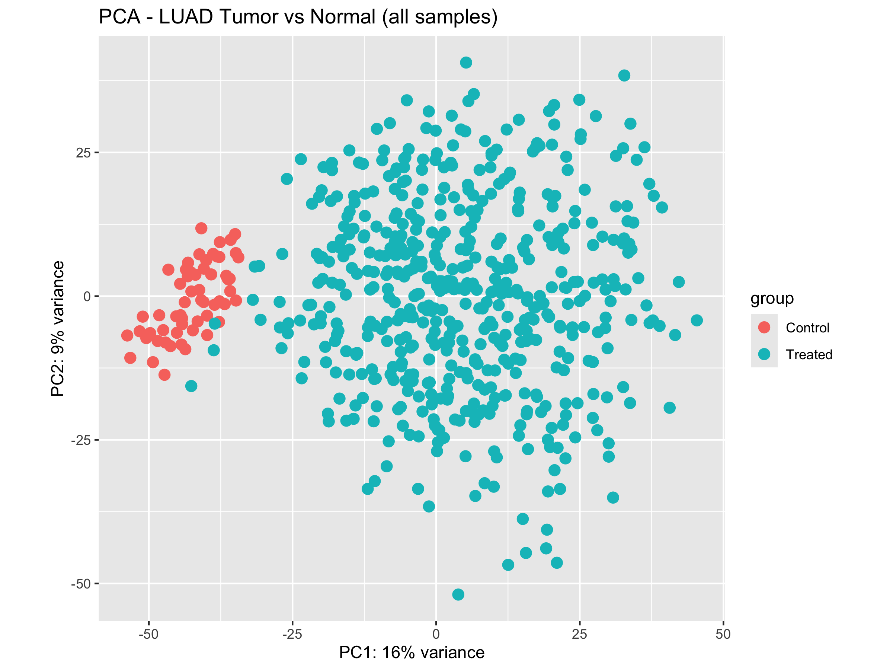
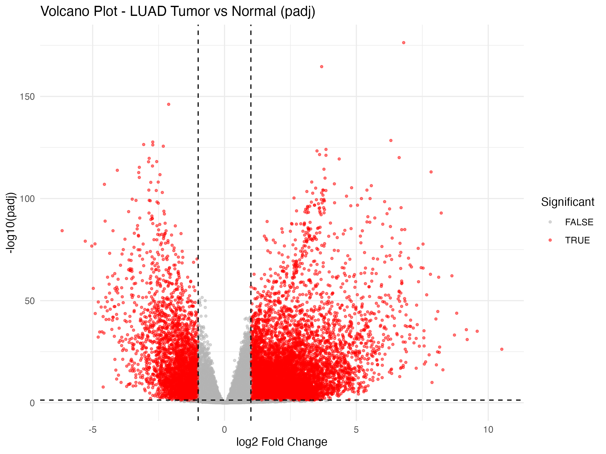
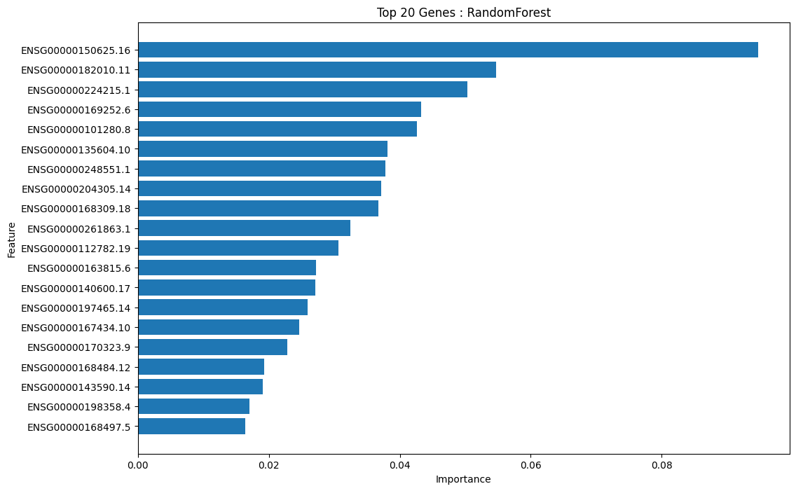
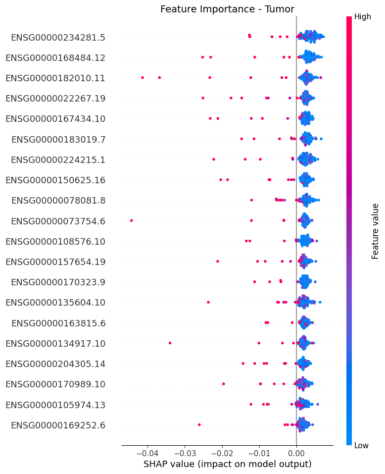
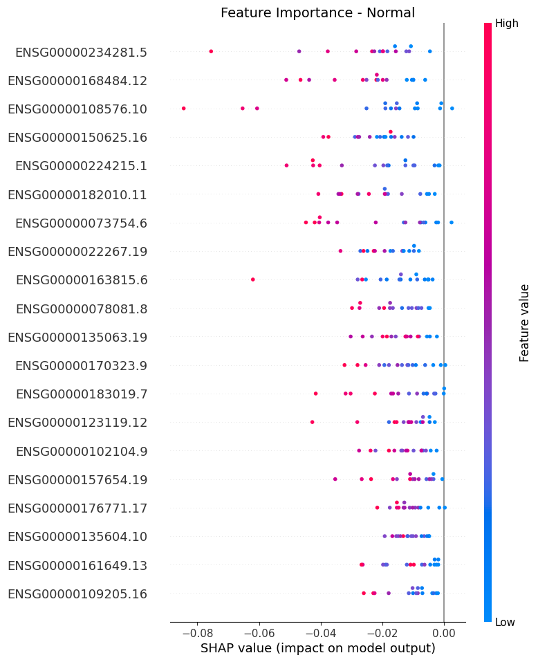
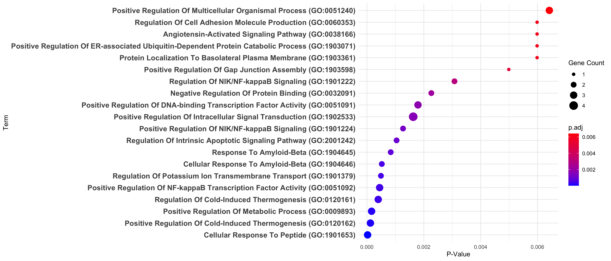

# TCGA-LUAD — DEG & ML Biomarker Discovery

Identifying lung adenocarcinoma (LUAD) gene-expression biomarkers from TCGA
RNA-seq data: **DESeq2** differential expression (BH/FDR-corrected) →
significance-filtered feature matrix → **Random Forest** + **deep neural
network** classification → **SHAP**-based marker selection → **GO/KEGG**
pathway enrichment.

**598 samples** (59 normal, 539 tumor) · **60,660 genes tested** → **110
genes** significant after multiple-testing correction · **97.5% test
accuracy** on both classifiers.

The full, authoritative pipeline lives in [`publication_v1/`](publication_v1/).
See [`PREPRINT_REFERENCE.md`](PREPRINT_REFERENCE.md) for a complete,
number-by-number methods reference.

---

## Results

**Tumor vs. normal samples separate cleanly on the first two principal
components** (PCA of all 598 samples on variance-stabilized expression):



**Differential expression, all 598 samples, BH-adjusted p-value:** thousands
of genes are differentially expressed at padj ≤ 0.05 and |log2FC| ≥ 1
(red) — this combined view is for visualization only; the actual DEG calls
driving downstream analysis come from 539 independent per-tumor-sample-vs-
pooled-control DESeq2 comparisons (see `publication_v1/data/DEG_RES_ALL/`,
excluded from this repo for size — regenerate via `scripts/01_diff_exp_analysis_padj.R`).



**Random Forest feature importance**, top 20 of the 110 significance-filtered
genes (test accuracy 97.5%):



**SHAP-based marker selection** — genes whose signed SHAP contribution most
strongly pushes the neural network's prediction toward tumor vs. toward
normal (20 markers per class; a gene can appear in both if it discriminates
strongly in both directions):

| Pushes toward Tumor | Pushes toward Normal |
|---|---|
|  |  |

**GO/KEGG pathway enrichment** on the SHAP marker sets (example: Biological
Process terms for the tumor-associated genes; full results — KEGG, GO-BP,
GO-MF, GO-CC, both marker sets — in
[`publication_v1/results/pathway_go/`](publication_v1/results/pathway_go/)
and [`publication_v1/figures/pathway_go/`](publication_v1/figures/pathway_go/)):



Additional QC diagnostics (MA plot, DESeq2 dispersion estimates) are in
[`publication_v1/figures/`](publication_v1/figures/).

---

## Repository layout

```
publication_v1/   The authoritative pipeline — start here (scripts, results, figures, env)
scripts/          Original pipeline (deprecated: raw p-value, not FDR-corrected — see below)
results/          Original pipeline's output
data/             Shared raw input counts + original pipeline's intermediate outputs
legacy/           Archived earlier iteration (Feb 2025) — superseded, kept for provenance
PREPRINT_REFERENCE.md   Full methods/results reference, every parameter and caveat documented
requirements.txt        Python dependencies
```

**Note on `scripts/`/`data/`/`results/` (project root):** this was the first
version of the pipeline and used DESeq2's **raw p-value** instead of a
multiple-testing-corrected one, across 60,660 genes tested per comparison —
a statistically flawed threshold that overstated the significant-gene count
(309 vs. the corrected 110). It's kept for provenance only. **Use
`publication_v1/` for anything citable.**

## `publication_v1/` — pipeline stages

1. **`scripts/01_diff_exp_analysis_padj.R`** — DESeq2, 539 independent
   per-tumor-sample-vs-pooled-normal comparisons, BH-adjusted p-value
   (`padj ≤ 0.05`), `|log2FC| ≥ 1`. Parallelized (`mc.cores=4`).
2. **`scripts/02_data_process_padj.py`** — keeps genes significant in
   ≥ 90% of the 539 comparisons → 110 genes.
3. **`scripts/03_biomarker_shap_padj.py`** — Random Forest +
   Keras neural network classification, SHAP-based signed-contribution
   marker selection (20 tumor + 20 normal genes).
4. **`scripts/04_pathway_go_enrichment.R`** — GO/KEGG enrichment
   (biomaRt + enrichR) on the SHAP marker sets.
5. **`scripts/05_qc_diagnostics.R`** — PCA, MA, volcano, dispersion plots.

Full parameters, exact gene/marker lists, model metrics, and every known
caveat (reproducibility limits, class imbalance, cosmetic plot-labeling
issues, etc.) are documented in [`PREPRINT_REFERENCE.md`](PREPRINT_REFERENCE.md).

## Environment setup

```bash
python3 -m venv BIOENV
source BIOENV/bin/activate   # Windows: BIOENV\Scripts\activate
pip install -r requirements.txt
```

R dependencies: `DESeq2`, `tibble`, `dplyr`, `purrr`, `writexl`, `biomaRt`,
`enrichR`, `ggplot2`, `stringr`, `readxl` (Bioconductor packages via
`BiocManager::install()`, CRAN packages via `install.packages()`).
